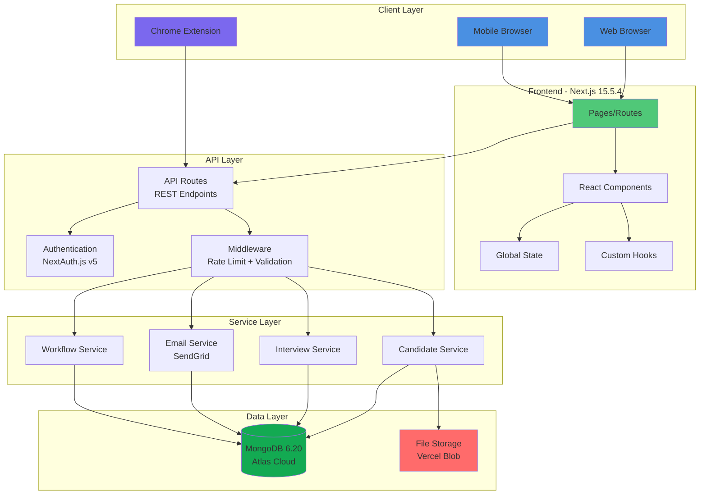
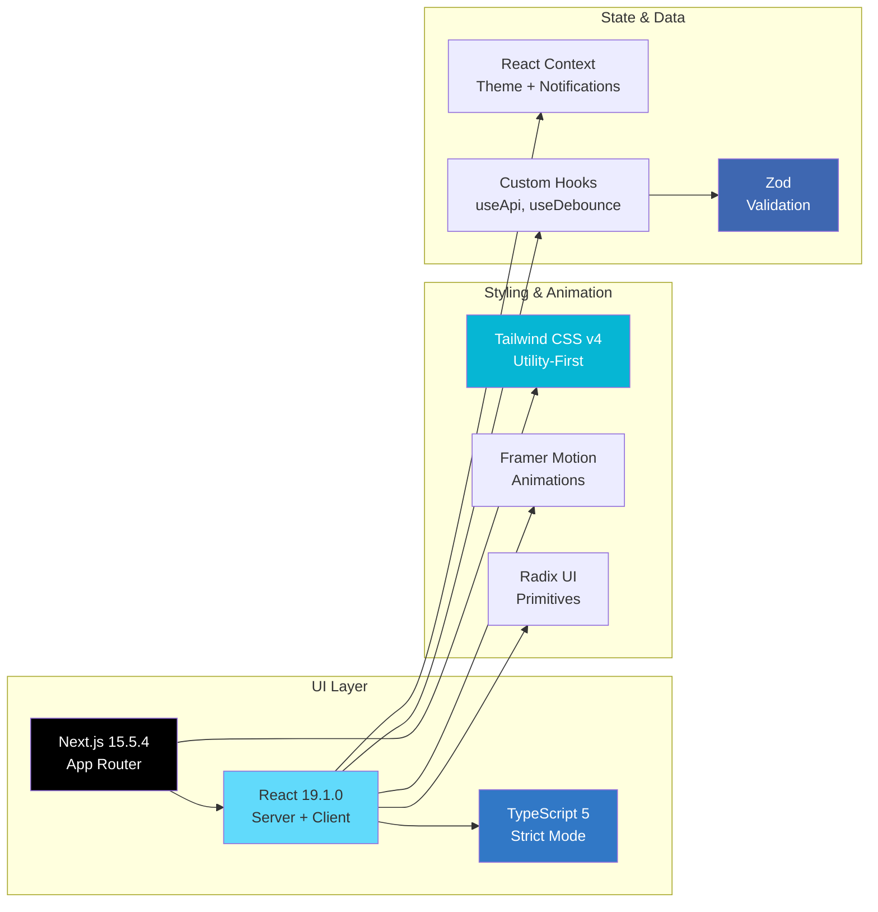
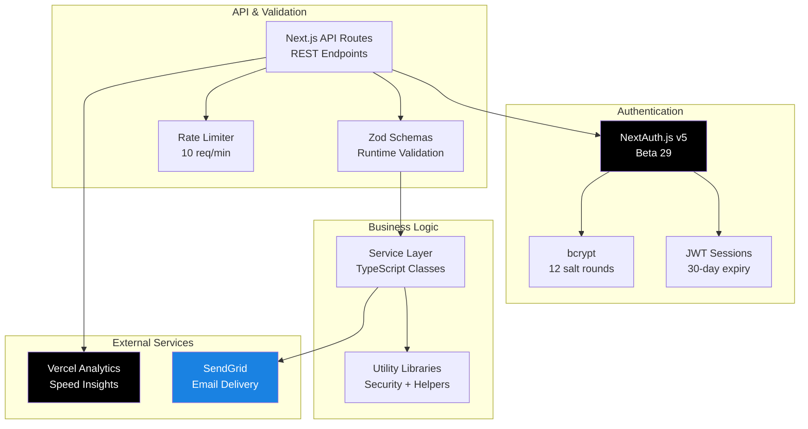
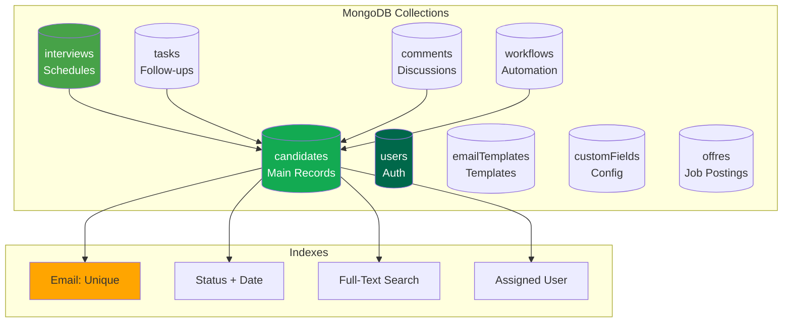
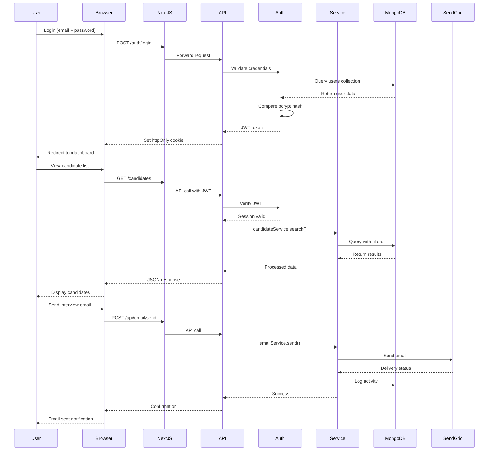
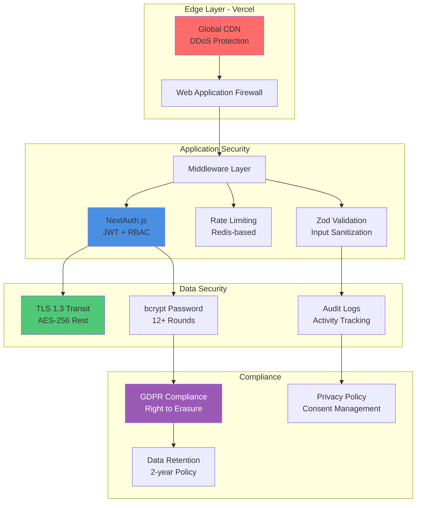
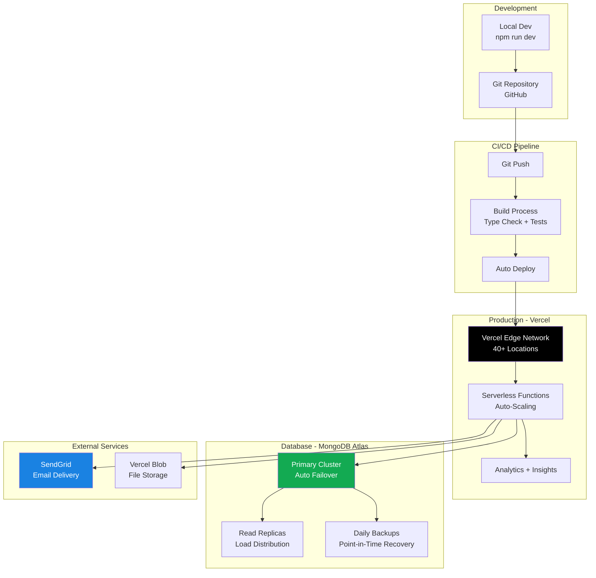
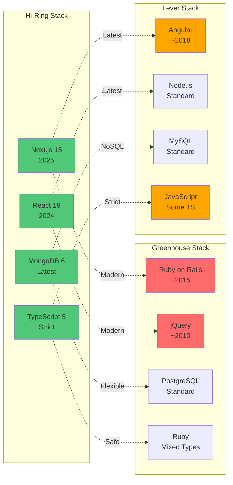
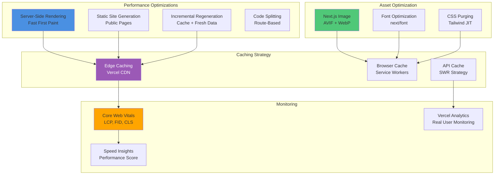

# Hi-Ring: Technology Stack Diagrams

**Visual Architecture Overview**

---

## 1. System Architecture Overview



---

## 2. Frontend Technology Stack



---

## 3. Backend Technology Stack



---

## 4. Database Architecture



---

## 5. Data Flow Diagram



---

## 6. Security Architecture



---

## 7. Deployment Architecture



---

## 8. Technology Comparison Matrix



---

## 9. Performance Architecture



---

## 10. Development Workflow

```mermaid
graph LR
    subgraph "Local Development"
        Code[Write Code<br/>VSCode]
        Lint[ESLint Check<br/>Auto-fix]
        TypeCheck[TypeScript<br/>Strict Mode]
        Test[Vitest Tests<br/>Unit + Integration]
    end

    subgraph "Git Workflow"
        Commit[Git Commit<br/>Husky Hooks]
        Push[Git Push<br/>GitHub]
    end

    subgraph "CI/CD"
        BuildCI[Build Check<br/>GitHub Actions]
        TestCI[Test Suite<br/>Automated]
        PreviewDeploy[Preview Deploy<br/>Vercel]
    end

    subgraph "Production"
        MainDeploy[Main Deploy<br/>Automatic]
        Monitor[Monitoring<br/>Errors + Performance]
    end

    Code --> Lint
    Lint --> TypeCheck
    TypeCheck --> Test
    Test --> Commit
    Commit --> Push
    Push --> BuildCI
    BuildCI --> TestCI
    TestCI --> PreviewDeploy
    PreviewDeploy --> MainDeploy
    MainDeploy --> Monitor
    Monitor -.Feedback.-> Code

    style Code fill:#4A90E2
    style Commit fill:#50C878
    style MainDeploy fill:#9B59B6,color:#fff
    style Monitor fill:#FFA500
```



---

## How to View These Diagrams

### Method 1: GitHub/GitLab (Automatic Rendering)
Push this file to GitHub or GitLab—Mermaid diagrams render automatically.

### Method 2: VS Code Extension
Install **Mermaid Preview** extension in VS Code:
```bash
ext install vstirbu.vscode-mermaid-preview
```

### Method 3: Online Editors
- **Mermaid Live Editor**: https://mermaid.live/
- **Markdown Preview Enhanced**: VS Code extension

### Method 4: Export to Images
Use Mermaid CLI to generate PNG/SVG:
```bash
npm install -g @mermaid-js/mermaid-cli
mmdc -i TECH_STACK_DIAGRAMS.md -o diagrams.pdf
```

---

## Diagram Legend

| Color | Meaning |
|-------|---------|
| 🟢 Green | Modern/Optimized Technology |
| 🔵 Blue | Core Infrastructure |
| 🟣 Purple | Security/Compliance |
| 🟠 Orange | Monitoring/Analytics |
| 🔴 Red | Legacy/Outdated (Competitors) |

---

**Document Version**: 1.0
**Created By**: Jeff Pruvost
**Date**: October 2025
**Format**: Mermaid Diagrams (Markdown)

---

*Visual architecture documentation for Hi-Ring recruitment platform*
